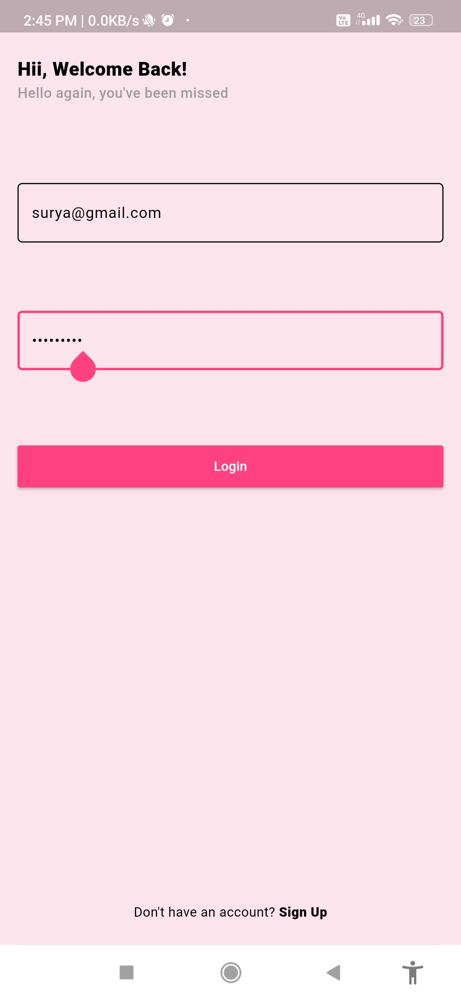

# Talkaholic Chat Application

Welcome to the **Talkaholic Chat Application** repository! 🚀  
This project is a feature-rich and interactive chat application focused on delivering an exceptional user experience through unique and innovative UI elements.

## 🌟 Features

### 1. Message Page
- A streamlined chat interface designed for seamless messaging.

### 2. Utility Page
This section houses several powerful features:
- **Registered User Chat Option**: Enables secure and personalized chatting for registered users.
- **Encryption and Decryption Page**: Ensures message security by encrypting and decrypting texts.
- **AI Chat Page**: Experience the power of AI-driven conversations.
- **Scheduled Message Screen (UI only)**: Plan your messages ahead of time with a visually appealing scheduling interface.
- **Word Dash Game**: A fun, text-based game to enhance your vocabulary and typing speed.

### 3. Unique UI Elements
- **Giftbox-style Message Delivery**: Messages are initially displayed as gift boxes and reveal content when tapped.
- **Theme Selection**: Personalize the app’s appearance with various themes.
- **Text-to-PDF Generation**: Convert text into a downloadable PDF with ease.
- **PDF-to-Text Conversion**: Extract text from PDF files and display it within the app.

## 🛠️ Technologies Used
- **Flutter**: For building cross-platform mobile applications.
- **Dart**: Programming language for Flutter development.

## 📂 Project Structure
- `lib/`: Contains all the Dart code for the app.
- `assets/`: Houses images, fonts, and other static resources.
- `test/`: Contains test files for ensuring application quality.

## 🚀 Getting Started
### Prerequisites
- Flutter SDK installed on your machine.
- A compatible IDE such as Android Studio or Visual Studio Code.

### Installation
1. Clone the repository:  
   ```bash
   git clone https://github.com/Surya-2k4/Talkaholic-Chat-Application.git
   ```
2. Navigate to the project directory:  
   ```bash
   cd Talkaholic-Chat-Application
   ```
3. Install dependencies:  
   ```bash
   flutter pub get
   ```
4. Run the app:  
   ```bash
   flutter run
   ```
---

## 📸 Screenshots

### 🌟 Login Page and Register Page  
<p>
  
  
</p>

### 🌟 Utility Page and Home Page  

<p>
  
  
</p>

### 🌟 Ai Chat Page and Encryption & Decrytion Page  

<p>
  
  
</p>

### 🌟 Text2Pdf & ViceVersa Page and Word Dash Game Page  

<p>
  
  
</p>

### 🌟 Theme Selection

<p>
  

</p>


---

## 🤝 Contributing
Contributions are welcome! Please follow these steps to contribute:
1. Fork the repository.
2. Create a new branch:  
   ```bash
   git checkout -b feature-name
   ```
3. Commit your changes:  
   ```bash
   git commit -m "Add feature-name"
   ```
4. Push to your branch:  
   ```bash
   git push origin feature-name
   ```
5. Submit a pull request.

---

Feel free to star ⭐ this repository if you find it useful. For any questions or feedback, please create an issue or contact me directly!

